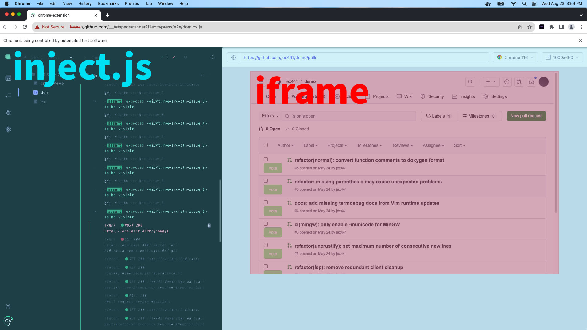

# Cypress Testing Setup Instructions

This guide will assist you in setting up Cypress for testing the Turbosrc web extension. Please follow these instructions.

## Instructions

### Step 1: Create the Cypress Environment File

1. Create a new file named `cypress.env.json` in your project root directory.

2. Paste the following JSON object into the `cypress.env.json` file:

    ```json
    {
        "turboSrcID": "0x9e81be64b30a850e038cb5a85241f58528010016",
        "gitHubUsername": "YourUsernameHere",
        "gitHubPassword": "YourPasswordHere",
        "gitHubToken": "githubTokenHashHere",
        "gitHubRepo": "YourRepoNameHere"
    }
    ```

3. Replace the placeholders with your actual information:

    - `YourUsernameHere`: Replace with your GitHub username.
    - `YourPasswordHere`: Replace with your GitHub password.
    - `githubTokenHashHere`: Replace with your GitHub token hash.
    - `YourRepoNameHere`: Replace with your GitHub repository name.

> Note: Ensure all replaced items are formatted as strings.

### Step 3: Bundle the extension
Open the terminal, navigate to the `chrome-extension` directory in your project, and execute the following command:

```bash
yarn devLocalTest
```

You have successfully set up Cypress testing for your project. Your environment is now ready for executing test cases.

Run createRepo.cy.js to seed a user and repo. Then run DOM.cy.js to check that the VoteStatusButtons render in the DOM. Run ext.cy.js to check the DOM of the web extension. Further tests are coming.

# Troubleshooting:

### Login.cy.js failed:
If you encounter a two step log in process thru GitHub, please click the green 'Authorize' button in the testing window GitHub DOM, and rerun the tests. GitHub on occaison has an additional prompt for authenticating and Cypress tests are not conditional by design.

### GitHub said my password was incorrect:
If you are confident your GitHub password is correct in the cypress.env.json file and are still having trouble logging in to GitHub via
the login command in cypress/support/commands.js as accessed by the tests, try running the test on a wifi connection known to GitHub as being associated with your account. Sometimes public wifi causes this test to fail.

## I don't see the VoteStatusButtons when I rerun the tests:
You will need to run step 3 again to see changes you've made to your code between running tests. You can not just click rerun in the Cypress spec window.

## I don't see the VoteStatus buttons in the GitHub DOM:
Ensure you have run the createRepo.cy.js spec one time. Close and reopen Cypress and try the DOM spec again.

Check the console. There are warnings and key variables logged to help debug this issue. The most common cause is switching between
"test" and "development" Node environments. If you are running tests, having run yarnDevLocal test, ensure the key variables logged to the console look like this:
```
{
    testMode: true,
    testingDOM: iframe#Your project: 'Test Project'.aut-iframe,
    contributor_id: <Your id which is the same as the on in the account page in the Turbosrc web extension>
}
```

If any of the above are not accurate, close Cypress and run yarnDevLocal test again. If the issue persists, refresh the extension in the extension manager in the Cypress testing window. Also consider running ./tsrc-dev restart again and repeating the tests.

If you are running in a normal browser window and running yarnDevLocal, the key variables should look like:
```
{
    testMode: false,
    testingDOM: false,
    contributor_id: <Your id which is the same as the on in the account page in the Turbosrc web extension>
}
```

Sometimes switching from yarn devLocalTest to yarn devLocal the environment variable process.env.TEST persists to "true" when
it should be false. It is for this reason we want to phase out the use of environment variables to determine whether or not
the extension is being tested or used. In the meantime, remove the extension from the extension manager, reauthenticate, even if
you are already logged in, and refresh the page.

### The ext spec does not show the extension DOM:
Hit run tests again button a couple of times in the Cypress spec window. Ensure nothing else is running on port 5001.

# The only two major differences between testing Turbosrc and using Turbosrc

### 1. chrome.storage.local
When running the Cypress tests our app does not have access to the Chrome APIs including chrome.storage.local. Chrome.storage.local is used to have a local storage that both the web extension and the browser have access to. It is used to share information about the current logged in user and their session.

Because the Cypress testing environment does not have access to the chrome.storage API, if Turbosrc is running in the test environment, as deduced from checking the window.location.pathname, it will stub the user data by calling findOrCreateUser and  referencing the cypress.env.json file for the user's username and GitHub token. The variables needed in inject.js are set from the response of that function.

In production/development they are stored/fetched from the chrome.storage.local.

### 2. The DOM

Be aware that while the Turbosrc web extension interfaces with the code host, GitHub, to inject elements into the DOM, when running the tests, the DOM is not GitHub, but a Cypress.js test browser window, everything in blue above, with an iframe rendering the GitHub DOM, everything in the red above.

So in testing the "DOM" inject.js wants to target is a child element of the actual DOM.

For this reason when querying the DOM, a helper function querySelectorAllFrames() is used in development, production, and testing instead of document.querySelectorAll, so that regardless of a node element being in the document or a child of the document (iframe) the nodes you are trying to select and manipulate will be selected no matter how nested.

### Area for improvement:
Additionally, while we need to wait for either DOM to load before injecting, when we are testing the load function is document.onLoad(function()...) and using Turbosrc as normal the listener is document.readyState === 'complete'. Finding one listener for either event  would be ideal.

